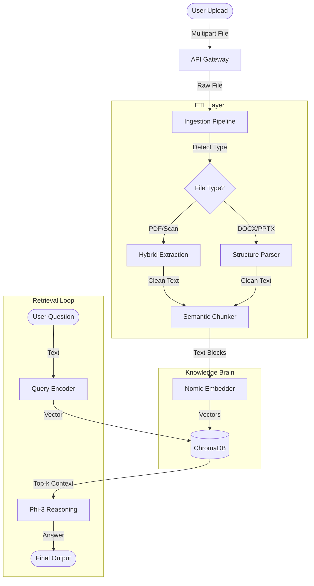

# modelsForDoc: Context-Aware Document Intelligence System


> **"Turning static documents into interactive conversations."**

## 📖 Overview
**modelsForDoc** is an advanced Retrieval-Augmented Generation (RAG) engine built to solve the challenge of querying unstructured data. Unlike simple keyword search, this system "reads" your documents (PDF, DOCX, Images, CSV), understands the semantic context, and answers complex queries using a local LLM (**Phi-3**).

It features a robust **ETL pipeline**, **hybrid extraction strategies** (transparency between OCR and text), and a **semantic reasoning layer** powered by **Nomic** embeddings.

---

## 🏗️ System Architecture & Workflow

The system follows a linear data flow: **Ingest → Process → Understand → Answer**.



### 📂 Project Structure
```bash
modelsForDoc/
├── DocumentApp/
│   ├── extractors.py       # (ETL) Hybrid PDF/Image/DOCX extraction logic
│   ├── chunker.py          # (ETL) Recursive semantic text splitting
│   ├── ollama_embedding.py # (Model) Nomic interface for vector generation
│   ├── ollama_llm.py       # (Model) Phi-3 interface for reasoning
│   ├── ingest_pipeline.py  # (Core) Orchestrator for the Ingest -> DB flow
│   ├── models.py           # DB Schemas (Document, Chunk, QueryHistory)
│   └── views.py            # Rest Framework API Views
├── chroma_db/              # Persistent Vector Store
├── media/                  # File Storage
└── manage.py               # Django Entry Point
```

---

## 🔍 Detailed Process Breakdown

### 1. Ingest & Store
*   **Entry Point**: `DocumentUploadView` (REST API).
*   **Storage**: Original files are safery stored in `media/documents/`; metadata in PostgreSQL/SQLite.

### 2. The Extraction Layer (`extractors.py`)
We employ a **hybrid strategy**. We first attempt low-cost native text extraction. If that yields empty results (e.g., scanned PDFs), we seamlessy switch to optical character recognition (OCR).

**Snippet: Hybrid Extraction Logic**
```python
def extract_text_from_pdf(path):
    # 1. Try native PDF text extraction (Fast)
    with pdfplumber.open(path) as pdf:
        text = "\n".join([p.extract_text() for p in pdf.pages if p.extract_text()])

    # 2. Fallback to OCR if PDF is scanned/empty (Robust)
    if not text.strip():
        logger.info("Running OCR on PDF pages...")
        images = convert_from_path(path, dpi=300)
        # Uses EasyOCR GPU acceleration
        text = "\n".join(reader.readtext(np.array(img), detail=0))
            
    return text
```

### 3. Smart Chunking (`chunker.py`)
To prevent context loss, we don't just split by lines. We use a **Recursive Character strategy** that respects paragraph boundaries and maintains an **overlap**.
*   **Chunk Size**: 800 characters
*   **Overlap**: 200 characters

**Snippet: Recursive Splitting**
```python
def chunk_document_text(document):
    splitter = RecursiveCharacterTextSplitter(
        chunk_size=800,
        chunk_overlap=200,
        separators=["\n\n", "\n", " ", ""], # Priority to paragraph breaks
    )
    return splitter.split_text(document)
```

### 4. Embedding & Vector Storage (`ollama_embedding.py`)
Text chunks are transformed into 768-dimensional vectors using `nomic-embed-text`. These are stored in **ChromaDB**, indexed for Cosine Similarity search.

```python
# Each chunk is mapped to a vector space where "King" and "Queen" are close
r = ollama.embeddings(model="nomic-embed-text", prompt=chunk_text)
vector = r["embedding"] 
```

---

## 🧠 The Thinking Process (Retrieval)
The "Brain" of the system (`views.py` + `ollama_llm.py`) follows a strict cognitive architecture to answer questions:

1.  **Retrieve**: The user's query is embedded. We search ChromaDB for the **Top 5** most semantically similar chunks.
2.  **Ground**: We construct a `context` string from these chunks.
3.  **Synthesize**: We force the LLM to answer *only* using that context.

**LLM Prompt Template:**
```text
Context:
{retrieved_chunks}

Question: {user_query}

Answer: (Answer strictly based on the context above)
```

> **[PLACEHOLDER: Insert Screenshot of Chat/JSON Response Here]**

---

## ⚡ API Usage Examples

### 1. Upload Document
```bash
curl -X POST -F "file=@/path/to/invoice.pdf" http://localhost:8000/api/upload/
```

### 2. Search / Chat
```bash
curl -X POST -H "Content-Type: application/json" \
     -d '{"query": "What is the total amount due?"}' \
     http://localhost:8000/api/search/
```
**Response:**
```json
{
    "answer": "The total amount due is $4,500.00, payable by March 1st.",
    "sources": [
        {"chunk_text": "TOTAL AMOUNT: $4,500.00...", "page": 1}
    ]
}
```

---

## 📊 Evaluation Matrix
Quality is monitored via the `QueryHistory` model.

| Metric | Definition | Implementation |
| :--- | :--- | :--- |
| **Retrieval Accuracy** | Are distinct, relevant chunks found? | Check `sources` in API response. |
| **Faithfulness** | Does the answer hallucinate? | Compare `answer` text vs `chunk_text`. |
| **Response Time** | System latency. | Logged in `ingest_pipeline` (Extraction time) vs `views` (Inference time). |

---

## 🤝 Contributing
1.  Fork the repo.
2.  Create your feature branch (`git checkout -b feature/NewExtractor`).
3.  Commit your changes.
4.  Push to the branch.
5.  Open a Pull Request.

## 📄 License
MIT License.
